notes.R
================
- copy scripts to *plotting_rnaseq* directory ([download](https://proj-bip-prod-publicread.s3.amazonaws.com/training/R_Intro/plotting_rnaseq.zip)) and open in RStudio. 
- **[clean_names.R script](clean_names.R):** run this script first to generate cleaned up tables
- **[notes.R script](notes.R):**  Click the little notebook button to make a nice report!

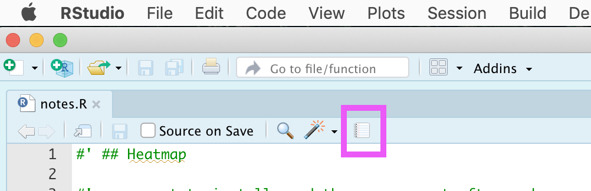

## Heatmap

uncomment to install, and then re-comment afterward.

``` r
# install.packages("pheatmap")
library(pheatmap)
library(readr)
```

read in Transcripts per Million output of `analyzeRepeats.pl` from
HOMER.

``` r
tpm <- read_tsv("output_rna_clean.txt")
```

    ## Parsed with column specification:
    ## cols(
    ##   TranscriptID = col_character(),
    ##   chr = col_character(),
    ##   start = col_double(),
    ##   end = col_double(),
    ##   strand = col_character(),
    ##   Length = col_double(),
    ##   Copies = col_double(),
    ##   `Annotation/Divergence` = col_character(),
    ##   RNAseq_BM_SPF_rep1_VML_191115 = col_double(),
    ##   RNAseq_BM_SPF_rep2_VML_191115 = col_double(),
    ##   RNAseq_Th_SPF_rep1_VML_191115 = col_double(),
    ##   RNAseq_Th_SPF_rep2_VML_191115 = col_double(),
    ##   gene = col_character(),
    ##   genetype = col_character()
    ## )

``` r
colnames(tpm)
```

    ##  [1] "TranscriptID"                  "chr"                           "start"                        
    ##  [4] "end"                           "strand"                        "Length"                       
    ##  [7] "Copies"                        "Annotation/Divergence"         "RNAseq_BM_SPF_rep1_VML_191115"
    ## [10] "RNAseq_BM_SPF_rep2_VML_191115" "RNAseq_Th_SPF_rep1_VML_191115" "RNAseq_Th_SPF_rep2_VML_191115"
    ## [13] "gene"                          "genetype"

``` r
?pheatmap
pheatmap(tpm[,9:12], show_rownames = F, scale = 'row')
```

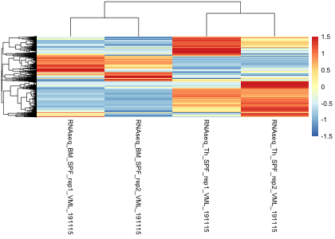<!-- -->

*tpm* has \~19k rows\! So takes some time. Uncomment line below to save
heatmap as pdf.

``` r
nrow(tpm)
```

    ## [1] 19211

``` r
#pheatmap(tpm[,9:12], show_rownames = F, scale = 'row', filename="allheatmap.pdf")
```

read in DESeq2 output of `getDiffExpression.pl` from HOMER

``` r
diffexp <- read_tsv("diff_rna_BM_vs_Th_clean.txt")
```

    ## Parsed with column specification:
    ## cols(
    ##   TranscriptID = col_character(),
    ##   chr = col_character(),
    ##   start = col_double(),
    ##   end = col_double(),
    ##   strand = col_character(),
    ##   Length = col_double(),
    ##   Copies = col_double(),
    ##   `Annotation/Divergence` = col_character(),
    ##   RNAseq_BM_SPF_rep1_VML_191115 = col_double(),
    ##   RNAseq_BM_SPF_rep2_VML_191115 = col_double(),
    ##   RNAseq_Th_SPF_rep1_VML_191115 = col_double(),
    ##   RNAseq_Th_SPF_rep2_VML_191115 = col_double(),
    ##   `Log2 Fold Change` = col_double(),
    ##   `BM vs. Th p-value` = col_double(),
    ##   `adj. p-value` = col_double(),
    ##   gene = col_character(),
    ##   genetype = col_character()
    ## )

``` r
diffexp10 <- diffexp[1:10,]
diffexp10$TranscriptID
```

    ##  [1] "NM_001289442" "NM_001290814" "NM_028275"    "NM_001166391" "NM_178687"    "NM_010248"   
    ##  [7] "NM_001198825" "NM_011101"    "NM_011770"    "NM_001166372"

*dplyr* filter for top 10

``` r
library(dplyr)
tpm10 <- filter(tpm, TranscriptID %in% diffexp10$TranscriptID)
dim(tpm10)
```

    ## [1]  8 14

  - why are there only 8? Missing ID also not in original
    output\_rna.txt

<!-- end list -->

``` r
setdiff(diffexp10$TranscriptID, tpm10$TranscriptID)
```

    ## [1] "NM_001166391" "NM_001166372"

  - remake heatmap with gene names

<!-- end list -->

``` r
pheatmap(tpm10[,9:12], labels_row = tpm10$gene, scale='row')
```

<!-- -->

add some simple annotation to the columns

  - check column names

<!-- end list -->

``` r
colnames(tpm10)
```

    ##  [1] "TranscriptID"                  "chr"                           "start"                        
    ##  [4] "end"                           "strand"                        "Length"                       
    ##  [7] "Copies"                        "Annotation/Divergence"         "RNAseq_BM_SPF_rep1_VML_191115"
    ## [10] "RNAseq_BM_SPF_rep2_VML_191115" "RNAseq_Th_SPF_rep1_VML_191115" "RNAseq_Th_SPF_rep2_VML_191115"
    ## [13] "gene"                          "genetype"

  - create annotation data frame

<!-- end list -->

``` r
annotation_col <- data.frame(
  Type = factor(c("BM", "BM", "Th", "Th"))
)
```

  - make sure rows have same names as *columns* of heatmap

<!-- end list -->

``` r
rownames(annotation_col) <- colnames(tpm10)[9:12]

pheatmap(tpm10[,9:12], labels_row = tpm10$gene, scale='row', annotation_col = annotation_col)
```

<!-- -->

## ggplot2

ggplot2 is based on *The Grammar of Graphics* by [Leland
Wilkinson](https://www.cs.uic.edu/~wilkinson/TheGrammarOfGraphics/GOG.html).
But, nowadays we associate [GoG with Hadley
Wickham](https://vita.had.co.nz/papers/layered-grammar.pdf) the author
of ggplot2. He is very influential in R programming - progenitor of the
“tidyverse.” ggplot2 is probably the MOST popular plotting package in
R, and heavily influences graphing grammars in other languages, notably
python and js.

``` r
library(ggplot2)
```

### Scatter plot

1.  start with ggplot function - specify data and “aesthetics”
2.  add “geoms” which are the type of plot (points, lines, bars, etc)
3.  add “scales” which further specify the aesthetics: axes, colors,
    sizes 

<!-- end list -->

*Aesthetics* map from variables in the data to components of
    the graph.

``` r
ggplot(diffexp, aes(x=`Log2 Fold Change`, y=`adj. p-value`)) + geom_point()
```

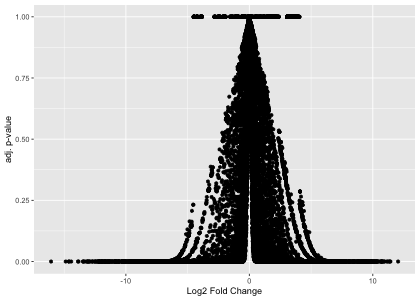<!-- -->

For volcano plot we do -Log10 of p-value

``` r
diffexp$newvalue <- -log10(diffexp$`adj. p-value`)
```

How should we deal with these infinite values? However we do it, we
should alert the reader in the caption. Set the “Inf” values equal to
300 for plotting.

``` r
head(diffexp$newvalue)
```

    ## [1]      Inf      Inf      Inf      Inf 288.0315 287.1296

``` r
head(diffexp$`adj. p-value`)
```

    ## [1]  0.000000e+00  0.000000e+00  0.000000e+00  0.000000e+00 9.301209e-289 7.420038e-288

``` r
diffexp$newvalue[1:4] <- 300

ggplot(diffexp, aes(x=`Log2 Fold Change`, y=newvalue)) + geom_point()
```

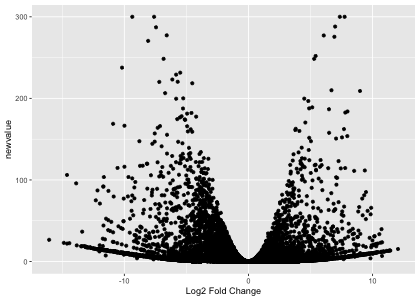<!-- -->

Better way is to add 1 to the p-values, so we avoid taking the log of 0.
This is more robust, as we don’t have to check the largest value to
replace `Inf`. We can do this in all situations.

``` r
diffexp$badlog10 <- -log10(1 + diffexp$`adj. p-value`)
```

Why do we get so many zeroes?

``` r
head(diffexp$badlog10, 20)
```

    ##  [1] 0 0 0 0 0 0 0 0 0 0 0 0 0 0 0 0 0 0 0 0

Computing \(log(1+x)\) suffers when \(|x| << 1\). `log1p` was written to
increase precision of this computation. We use it with the change of
base formula to calculate -log10(1 + *p-value*):

``` r
diffexp$`-Log10 adj. p` <- -log1p(diffexp$`adj. p-value`)/log(10)
head(diffexp$`-Log10 adj. p`)
```

    ## [1]   0.000000e+00   0.000000e+00   0.000000e+00   0.000000e+00 -4.039464e-289 -3.222482e-288

``` r
ggplot(diffexp, aes(x=`Log2 Fold Change`, y=`-Log10 adj. p`)) + geom_point()
```

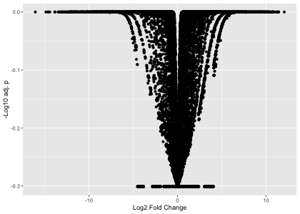<!-- -->

**Scales and colors**

Could also change the scale. *Scales* change the scale (quantitative or
qualitative) of an aesthetic mapping.

``` r
ggplot(diffexp, aes(x=`Log2 Fold Change`, y=`adj. p-value`)) + geom_point() + scale_y_log10()
```

    ## Warning: Transformation introduced infinite values in continuous y-axis

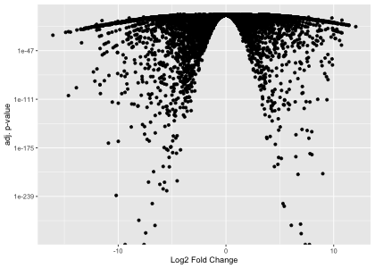<!-- -->

We can color the points based on p-value

``` r
ggplot(diffexp, aes(x=`Log2 Fold Change`, y=`-Log10 adj. p`, color=`-Log10 adj. p`)) + geom_point()
```

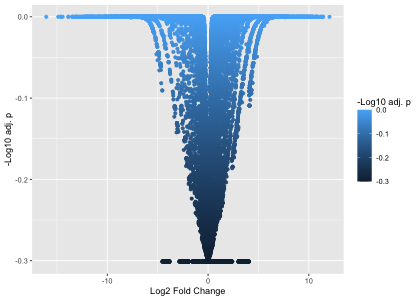<!-- -->

change the gradient scale

``` r
ggplot(diffexp, aes(x=`Log2 Fold Change`, y=`-Log10 adj. p`, color=`-Log10 adj. p`)) + geom_point() + scale_color_gradient(low = "royalblue",high="goldenrod")
```

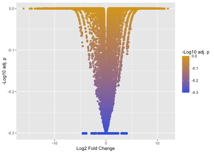<!-- -->

We can color the points based on gene type

``` r
ggplot(diffexp, aes(x=`Log2 Fold Change`, y=`-Log10 adj. p`, color=genetype)) + geom_point()
```

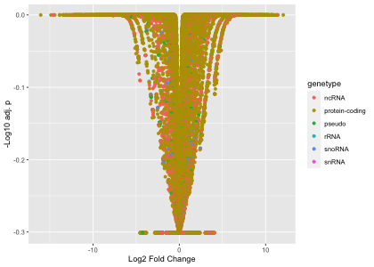<!-- -->

**Q:** Why the difference in the color scales?

**A:** Because we have different classes of variables. p-value is a
continuous numeric. And the genetype is a discrete character.

For discrete scales, we use `scale_color_manual` to change the color. We
give one color for every distinct value of genetype in our data.

``` r
unique(diffexp$genetype)
```

    ## [1] "protein-coding" "ncRNA"          "pseudo"         "snoRNA"         "snRNA"          "rRNA"

``` r
ggplot(diffexp, aes(x=`Log2 Fold Change`, y=`-Log10 adj. p`, color=genetype)) + geom_point() + scale_color_manual(values = c("red", "blue", "green", "yellow", "purple", "brown"))
```

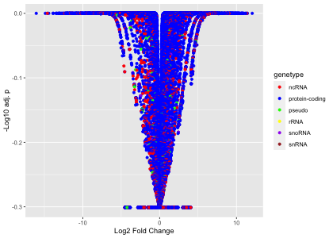<!-- -->

**Saving plots**

Save most recent plot to file

``` r
ggsave("volcanoplot.pdf")
```

    ## Saving 7 x 5 in image

Can also assign variable name to plot and then save that.

``` r
myplot <- ggplot(diffexp, aes(x=`Log2 Fold Change`, y=`-Log10 adj. p`, color=`-Log10 adj. p`)) + geom_point() + scale_color_gradient(low = "royalblue",high="goldenrod")
ggsave("myplot.pdf", myplot)
```

    ## Saving 7 x 5 in image

### Long vs wide data

ggplot expects **long data**. Long data is where each column corresponds
to a single variable, so you can match up variables to aesthetics.

``` r
print(tpm10[,-c(1:7)])
```

    ## # A tibble: 8 x 7
    ##   `Annotation/Diverge… RNAseq_BM_SPF_re… RNAseq_BM_SPF_re… RNAseq_Th_SPF_re… RNAseq_Th_SPF_r… gene  genetype
    ##   <chr>                            <dbl>             <dbl>             <dbl>            <dbl> <chr> <chr>   
    ## 1 Grap2|GRAP-2|GRB2L|…             0.658             0.67            217.             210.    Grap2 protein…
    ## 2 App|Abeta|Abpp|Adap…            24.7              21.6               0.341            0.379 App   protein…
    ## 3 Ikzf2|A730095J18Rik…             0.565             0.571            87.8            119.    Ikzf2 protein…
    ## 4 Lrmda|1700112E06Rik…            14.1              10.7               0.023            0.033 Lrmda protein…
    ## 5 Prkca|AI875142|Pkca…             0.276             0.239            24.5             27.0   Prkca protein…
    ## 6 Cd226|BC051526|DNAM…             0.936             0.843           154.             183.    Cd226 protein…
    ## 7 Gab2|AI463667|D1300…            32.4              25.9               0.209            0.285 Gab2  protein…
    ## 8 Aff3|3222402O04Rik|…             0.136             0.206            42.9             41.8   Aff3  protein…

Use `gather` from tidyr to “gather together” the sample names and tpm
measurements.

``` r
library(tidyr)

longtpm <- gather(tpm10, key = "sample", value = "TPM", starts_with("RNAseq"))
head(longtpm[,-c(1:7)])
```

    ## # A tibble: 6 x 5
    ##   `Annotation/Divergence`                                      gene  genetype    sample                  TPM
    ##   <chr>                                                        <chr> <chr>       <chr>                 <dbl>
    ## 1 Grap2|GRAP-2|GRB2L|GRBLG|GRID|Gads|GrbX|Grf40|GrpL|Mona|P38… Grap2 protein-co… RNAseq_BM_SPF_rep1_…  0.658
    ## 2 App|Abeta|Abpp|Adap|Ag|Cvap|E030013M08Rik|betaApp|-|16 C3.3… App   protein-co… RNAseq_BM_SPF_rep1_… 24.7  
    ## 3 Ikzf2|A730095J18Rik|Helios|Zfpn1a2|Znfn1a2|-|1|1 C3|protein… Ikzf2 protein-co… RNAseq_BM_SPF_rep1_…  0.565
    ## 4 Lrmda|1700112E06Rik|2700009F18Rik|-|14|14 A3|protein-coding  Lrmda protein-co… RNAseq_BM_SPF_rep1_… 14.1  
    ## 5 Prkca|AI875142|Pkca|-|11 E1|11 70.8 cM|protein-coding        Prkca protein-co… RNAseq_BM_SPF_rep1_…  0.276
    ## 6 Cd226|BC051526|DNAM-1|DNAM1|Pta1|TLiSA1|-|18|18 E4|protein-… Cd226 protein-co… RNAseq_BM_SPF_rep1_…  0.936

we can make a heatmap in ggplot as well, but it is not as easy to
annotate or draw the dendrogram/clustering.

``` r
ggplot(longtpm, aes(x=sample, y=gene, fill=TPM)) + geom_tile()
```

<!-- -->

Can make cosmetic changes with `theme`.

``` r
?theme
?element_text
ggplot(longtpm, aes(x=sample, y=gene, fill=TPM)) + geom_tile() + theme(axis.text.x = element_text(angle=90))
```

<!-- -->

Save your theme to a variable, so you can re-use it over and over.

``` r
mytheme <- theme_minimal() + theme(axis.text.x = element_text(angle=90))
ggplot(longtpm, aes(x=sample, y=gene, fill=TPM)) + geom_tile() + mytheme
```

<!-- -->

### More ways to plot

Histogram of p-values

``` r
ggplot(diffexp, aes(x=`adj. p-value`)) + geom_histogram(binwidth = 0.01, fill="powderblue", color="grey30") + mytheme
```

<!-- -->

Can convert continuous scale to discrete scale by converting numerics to
*factors*.

``` r
ggplot(diffexp[1:10,], aes(x=`Log2 Fold Change`, y=`-Log10 adj. p`, color=as.factor(`-Log10 adj. p`))) + geom_point() + mytheme
```

<!-- -->

^ is silly example. But makes more sense with fewer values or by
*binning*. Can use `cut`.

``` r
diffexp$plabel <- cut(diffexp$`-Log10 adj. p`, breaks=c(-0.31,-0.1,0), include.lowest = T)
ggplot(diffexp, aes(x=`Log2 Fold Change`, y=`-Log10 adj. p`, color=plabel)) + geom_point() + mytheme
```

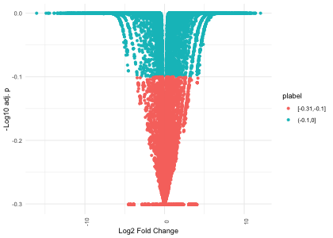<!-- -->

Label points with **ggrepel**

``` r
library(ggrepel)
ggplot(diffexp[1:10,], aes(x=`Log2 Fold Change`, y=`-Log10 adj. p`, color=plabel)) + geom_point() + geom_text_repel(aes(label=gene))
```

<!-- -->

label only the top 10 points by giving `geom_text_repel` its own data
argument. This will override the *data* argument of the main `ggplot`
function. So it will only use the first 10 rows of diffexp instead

``` r
ggplot(diffexp, aes(x=`Log2 Fold Change`, y=`-Log10 adj. p`, color=plabel)) + geom_point() + geom_text_repel(data=diffexp[1:10,], aes(label=gene))
```

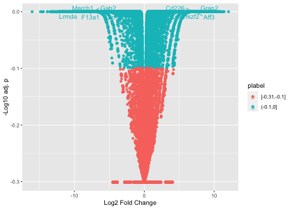<!-- -->

change the color of the labels to override the `color` aesthetic in the
main `ggplot` function.

``` r
ggplot(diffexp, aes(x=`Log2 Fold Change`, y=`-Log10 adj. p`, color=plabel)) + geom_point() + geom_text_repel(data=diffexp[1:10,], aes(label=gene), color="mediumorchid", fontface="bold")
```

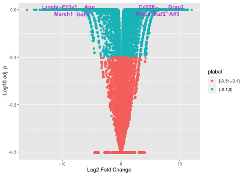<!-- -->

### Exercises

[Solution notes](exercise_solution.md) & [script](exercise_solution.R)

1.  Plot scatterplot gene vs TPM using just the top 10 genes with each
    sample a different color.
2.  Make your plots look pretty or at least suitable for publication.
    Use a theme\! Increase the font size to 14.
3.  Look up geom\_line (or geom\_bar) help. Make the same plot as \#1
    with lines (or bars) instead of points.
4.  Color the points in the volcano plot based on the fold change. Red
    for greater than 1, blue for less.
5.  For heatmap using pheatmap, change annotation column colors.
6.  Make heatmap of top 10 up-regulated and top 10 down-regulated genes.
    Which table(s) would you use? (Different ways to do it; one way is
    to use `rbind`).
